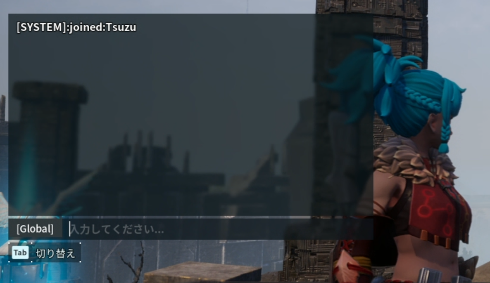

# palog

Broadcast messages that someone joined/left the game.

## Environment Variables
* RCON_ENDPOINT: Endpoint of RCON (IP:Port)
* RCON_PASSWORD: Password of RCON
* INTERVAL: Interval to check current players (default: 5s)
* TIMEOUT: Timeout of RCON calls (default: 1s)

## Known issues
* If the message is split via whitespaces, `Broadcast` sends only the first segment
